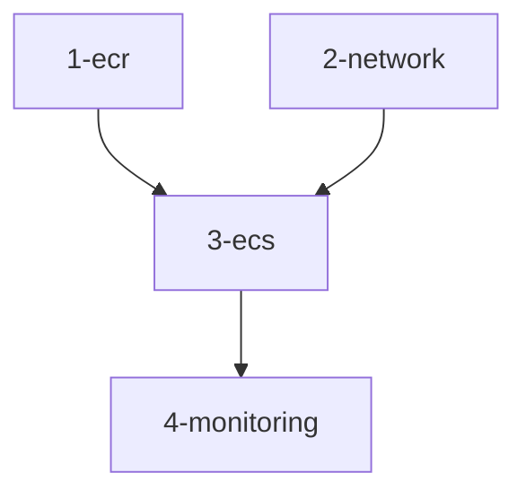

# Terraform Infrastructure Overview

This directory contains the complete infrastructure as code for deploying a FastAPI application with Nginx reverse proxy on Amazon ECS. The infrastructure is split into logical modules for maintainability and separation of concerns.

## Infrastructure Modules

### 1. Container Registry (1-ecr/)

Provides ECR repositories for storing container images:

- FastAPI application repository
- Nginx reverse proxy repository
- Image scanning and lifecycle policies
- Repository access policies

### 2. Networking Layer (2-network/)

Isolated VPC infrastructure:

- Public and private subnets across two AZs
- Internet Gateway for public access
- NAT Gateways for private subnet outbound traffic
- Route tables and network ACLs
- VPC Endpoints for AWS services:
  - ECR (api and dkr)
  - CloudWatch Logs
  - SSM
  - Systems Manager Session Manager
  - S3 Gateway

### 3. ECS Infrastructure (3-ecs/)

Container orchestration and application layer:

- ECS Cluster configuration
- Task Definitions for:
  - FastAPI application
  - Nginx reverse proxy
- ECS Services with:
  - Desired count and autoscaling
  - Task placement strategies
  - Service discovery
- Application Load Balancer:
  - Target groups
  - Health checks
  - HTTPS listeners (optional)
- Security Groups:
  - ALB ingress/egress
  - Container access
  - Service-to-service communication
- IAM Roles and Policies:
  - Task execution role
  - Task role with SSM permissions
  - Service-linked roles

### 4. Monitoring and Logging (4-monitoring/)

Observability infrastructure:

- CloudWatch Log Groups
- CloudWatch Alarms for:
  - Service health
  - Container metrics
  - Application metrics
- SSM Parameter Store for secrets
- Container Insights configuration
- X-Ray tracing (optional)

## Security Features

- Isolated VPC with proper subnet segmentation
- Security groups limited to required ports
- SSM Session Manager for container access
- Encrypted ECR repositories
- CloudWatch Logs encryption
- IAM roles following least privilege
- VPC endpoints for AWS service access

## High Availability

- Multi-AZ deployment
- Load balancer with health checks
- Auto-scaling capabilities
- Redundant NAT Gateways
- Service discovery for container communication

## Deployment Flow

1. Deploy ECR repositories
2. Build and push container images
3. Deploy networking layer
4. Deploy ECS infrastructure
5. Deploy monitoring components
6. Validate deployment

## Prerequisites

- AWS CLI configured
- Terraform 1.0+
- Docker installed
- Valid SSL certificate (if using HTTPS)

## Module Dependencies



## Important Configurations

Each module contains:

- `terraform.tfvars.example` for required variables
- README with specific module documentation
- Outputs used by dependent modules

## Usage

1. Deploy in order:

```bash
# From terraform/1-ecr
terraform init
terraform apply

# Build and push images
./build-and-push.sh

# From terraform/2-network
terraform init
terraform apply

# Continue with 3-ecs and 4-monitoring
```

2. Access application:

- ALB DNS name provided in outputs
- SSM Session Manager for container access
- CloudWatch Logs for application logs

## Cost Considerations

Major cost components:

- NAT Gateway hourly charges
- ALB hourly charges
- ECS tasks (based on container size)
- CloudWatch Logs storage
- VPC Endpoints

Consider:

- Single NAT Gateway for non-production
- Right-sizing container resources
- Log retention periods
- Required VPC endpoints

## Security Considerations

- Enable AWS Organizations SCPs
- Consider AWS Config Rules
- Implement AWS GuardDuty
- Regular security patches
- Container vulnerability scanning
- Access logging for ALB

## Future Enhancements

- AWS WAF integration
- Auto-scaling based on custom metrics
- Blue/green deployments
- Cross-region disaster recovery
- AWS Secrets Manager integration
- Container security scanning
